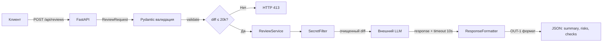

# ADR: решение для первого рабочего сценария

Файл ведёт OpenCode. Обсудите с агентом содержание и проверьте предложенный diff. Все дополнения и исправления поручайте агенту в чате.

- Статус: accepted
- Дата: 2026-09-01
- Ответственные: команда практики 1

## Контекст

AI-помощник ревьюера PR — FastAPI-сервис, который получает git diff через POST-запрос и возвращает структурированный отчёт с рисками. Текущая реализация (`app/api.py:36-37`, `app/review_service.py:19-22`) не обеспечивает валидацию входа, очистку секретов, обработку ошибок LLM и формат ответа. Это приводит к утечке секретов (SEC-1), падению при отсутствии ключа `diff` (KeyError), зависанию при недоступности LLM (REL-1) и неструктурированному ответу (OUT-1).

## Решение

Добавить в сервис четыре компонента:
1. **Pydantic-модели** `ReviewRequest(diff: str)` и `ReviewResponse` для валидации входа и выхода (HTTP 422 при невалидном payload, HTTP 413 при diff > 20k — API-1)
2. **SecretFilter** — модуль, очищающий diff от токенов, паролей и приватных ключей перед отправкой во внешний LLM (SEC-1)
3. **TimeoutWrapper** — обёртка над LLM.generate() с timeout 10 секунд; при ошибке — контролируемый ответ вместо HTTP 500 (REL-1)
4. **ResponseFormatter** — модуль, структурирующий ответ LLM в формат OUT-1: `{"summary": "...", "risks": [...], "checks": [...]}` с максимум 3 рисками

## Рассмотренные альтернативы

| Альтернатива | Почему не выбрали сейчас |
|---|---|
| Оставить как есть без изменений | Не решает проблемы безопасности (SEC-1), надёжности (REL-1) и предсказуемости формата (OUT-1). Ключ `diff` без валидации вызывает KeyError |
| Использовать FastAPI middleware для всей цепочки | Middleware подходит для cross-cutting concerns (логирование, CORS), но не для бизнес-логики форматирования и фильтрации секретов. Нарушает SRP |
| Вынести очистку секретов в отдельный микросервис | Добавляет сетевую задержку и точку отказа для задачи, которая решается простой функцией в ReviewService. Over-engineering для учебного кейса |
| Использовать промежуточный LLM для форматирования ответа | Увеличивает задержку и стоимость. Формат OUT-1 достижим простым парсингом текстового ответа LLM |

## Последствия и главный риск

- Положительные последствия: секреты не попадают во внешний LLM (SEC-1), вход валиден (HTTP 422/413), ответ предсказуемого формата (OUT-1), ошибки LLM обрабатываются контролируемо (REL-1), логирование соответствует OBS-1
- Ограничения: сервис по-прежнему только советует (SCOPE-1), не интегрирован с GitHub API, очистка секретов основана на regex и может пропустить нестандартные форматы
- Главный риск: SecretFilter может не распознать все форматы секретов (новые токены, нестандартные ключи)
- Как проверим риск: передать diff с различными форматами секретов (token, password, private_key, AWS key) и убедиться, что все заменены на [REDACTED]

## Архитектурная схема

## Как использовали AI

- Для чего: формулирование архитектурного решения и альтернатив на основе анализа TRAINING_PR.diff
- Тип промпта: master prompt
- Строка в [`prompts.md`](prompts.md): P1-03
- Что проверил студент и какие исправления поручил агенту: проверили, что каждое решение связано с конкретным правилом из [`context.md`](context.md) (SEC-1, API-1, REL-1, OUT-1), что альтернативы обоснованы, что mermaid-схема соответствует TO BE из analysis.md
