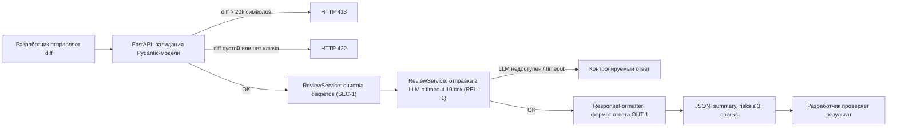

# Анализ процесса: AS IS и TO BE

Файл ведёт OpenCode. Обсудите с агентом содержание и проверьте предложенный diff. Все дополнения и исправления поручайте агенту в чате.

## AS IS

Разработчик открывает PR в репозитории. Текущий процесс выглядит так:

1. **Разработчик** отправляет POST-запрос на `/api/reviews` с JSON, содержащим ключ `diff` (`app/api.py:36-37`)
2. **FastAPI-сервис** напрямую берёт `payload["diff"]` без валидации наличия ключа или типа значения — при отсутствии `diff` возникает `KeyError` (`app/api.py:37`)
3. **ReviewService.review()** формирует промпт строкой `f"Review this pull request and find problems:\n{diff}"` и отправляет во внешний LLM (`app/review_service.py:20-21`)
4. **Внешний LLM** возвращает ответ как строку
5. **ReviewService** оборачивает ответ в `{"comment": answer}` и возвращает клиенту (`app/review_service.py:22`)

**Участники:** разработчик (открывающий PR), FastAPI-сервис, внешний LLM.

**Задержки:** нет timeout на вызов LLM — если LLM недоступен, запрос зависает или падает с 500.

**Ручные операции:** нет валидации входа, нет очистки секретов из diff перед отправкой в LLM.

**Точки потери информации:** 
- Секреты (токены, пароли, ключи) из diff попадают во внешний LLM без фильтрации (нарушение SEC-1)
- Нет логирования request_id, длительности и статуса (нарушение OBS-1)
- Ответ LLM не структурируется по формату OUT-1 (summary, risks, checks)

## TO BE

Процесс после изменений:
1. **Разработчик** отправляет POST-запрос с JSON, содержащим ключ `diff` (строка)
2. **FastAPI** валидирует вход через Pydantic-модель `ReviewRequest(diff: str)`. Пустой diff или отсутствие ключа → HTTP 422. Diff длиннее 20 000 символов → HTTP 413 (API-1)
3. **ReviewService** очищает diff от токенов, паролей и приватных ключей перед отправкой (SEC-1)
4. **ReviewService** отправляет очищенный diff во внешний LLM с timeout 10 секунд (REL-1)
5. При ошибке LLM или timeout возвращается контролируемый ответ, а не 500
6. **ResponseFormatter** структурирует ответ по формату OUT-1: `summary` (строка), `risks` (до 3 элементов с `file`, `line`, `evidence`, `risk`), `checks` (массив строк)
7. В лог пишутся только `request_id`, длительность и статус (OBS-1). Содержимое diff и ответа модели не логируется

## Разница

| Что меняется | AS IS | TO BE | Как проверим изменение |
|---|---|---|---|
| Валидация входа | `payload["diff"]` без проверки — KeyError при отсутствии | Pydantic-модель `ReviewRequest`, HTTP 422 при невалидном входе | Unit-тест: передать payload без ключа `diff`, ожидать ValidationError |
| Очистка секретов (SEC-1) | Diff отправляется во внешний LLM как есть | Перед отправкой токены/пароли/ключи заменяются на `[REDACTED]` | Unit-тест: передать diff с `token=abc123`, убедиться, что в промпте `[REDACTED]` |
| Timeout LLM (REL-1) | Нет timeout — запрос может зависнуть | Timeout 10 секунд, при превышении — контролируемый ответ | Integration-тест: mock LLM с задержкой > 10 сек, ожидать контролируемый ответ |
| Формат ответа (OUT-1) | `{"comment": " raw text"}` | `{"summary": "...", "risks": [...], "checks": [...]}` с максимум 3 рисками | Unit-тест: проверить JSON-схему ответа |
| Логирование (OBS-1) | Не логируется | Логируются `request_id`, длительность, статус | Integration-тест: проверить, что diff и ответ модели не в логах |

## Как использовали AI

- Для чего: структурирование AS IS и TO BE на основе TRAINING_PR.diff и context.md
- Тип промпта: master prompt
- Строка в [`prompts.md`](prompts.md): P1-03
- Что проверил студент и какие исправления поручил агенту: проверили, что каждый шаг TO BE подтверждён конкретным правилом из [`context.md`](context.md) (SEC-1, API-1, REL-1, OUT-1, OBS-1) и строкой из TRAINING_PR.diff
