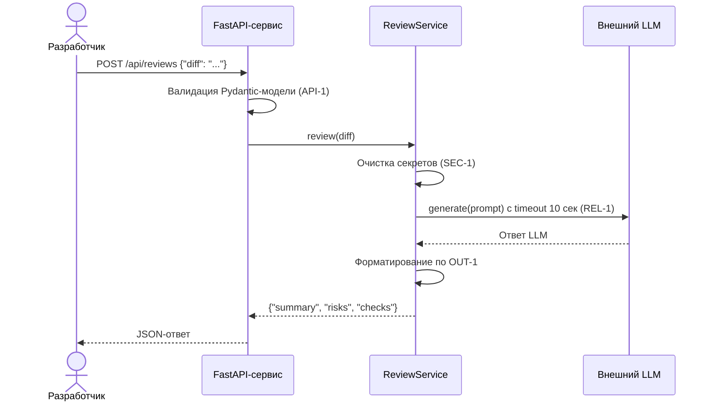

# Use cases и user stories

Файл ведёт OpenCode. Обсудите с агентом содержание и проверьте предложенный diff. Все дополнения и исправления поручайте агенту в чате.

## Первый рабочий сценарий

**Когда** разработчик открывает PR в репозитории, **система** анализирует diff и возвращает структурированный отчёт с рисками и проверками, **а пользователь получает** JSON с `summary`, массивами `risks` (до 3) и `checks`, что позволяет быстро оценить качество кода до ревью.

Не входит в этот сценарий:

- Интеграция с GitHub API (автоматический комментарий к PR)
- Approve или merge PR через сервис (SCOPE-1)
- Изменение кода в репозитории через сервис

## Use case

| Поле | Значение |
|---|---|
| Актор | Разработчик, открывающий PR |
| Триггер | POST-запрос на `/api/reviews` с JSON, содержащим ключ `diff` |
| Предусловия | Сервис запущен, внешний LLM доступен, diff передан валидной строкой |
| Основной результат | JSON: `{"summary": "...", "risks": [{"file": "...", "line": N, "evidence": "...", "risk": "..."}], "checks": ["..."]}` с максимум 3 рисками, каждый подтверждён строкой из diff или правилом репозитория |
| Ошибка или отказ | HTTP 422 — отсутствует ключ `diff` или значение не строка; HTTP 413 — diff длиннее 20 000 символов (API-1); HTTP 503 — LLM недоступен или timeout 10 сек (REL-1) |



## User stories и acceptance criteria

```gherkin
Feature: AI-ревью PR

  Scenario: Позитивный — валидный diff
    Given разработчик отправляет POST /api/reviews с JSON {"diff": "<валидный diff>"}
    And diff содержит не более 20 000 символов
    When запрос обрабатывается сервисом
    Then сервис возвращает JSON с полями summary, risks и checks
    And risks содержит не более 3 элементов
    And каждый risk подтверждён строкой из diff или правилом репозитория

  Scenario: Негативный — отсутствует ключ diff
    Given разработчик отправляет POST /api/reviews с JSON {"data": "какой-то текст"}
    When запрос обрабатывается сервисом
    Then сервис возвращает HTTP 422 с описанием ошибки валидации

  Scenario: Граничный — diff с секретами
    Given разработчик отправляет POST /api/reviews с diff, содержащим "token=abc123secret"
    When diff проходит через ReviewService
    Then перед отправкой в LLM токен заменяется на "[REDACTED]" (SEC-1)
    And secrets не попадают во внешний LLM
```

## Как использовали AI

- Для чего: формирование use case, user stories и mermaid-диаграммы на основе кейса из [`README.md`](README.md)
- Тип промпта: master prompt
- Строка в [`prompts.md`](prompts.md): P1-03
- Что проверил студент и какие исправления поручил агенту: проверили, что use case описывает реальный сценарий из TRAINING_PR.diff (POST /api/reviews с payload["diff"]), что user stories покрывают позитивный, негативный и граничный сценарии, что mermaid-диаграмма соответствует потоку из TO BE
