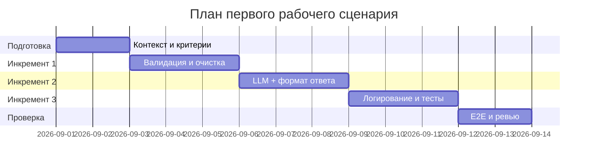

# План поставки

Файл ведёт OpenCode. Обсудите с агентом содержание и проверьте предложенный diff. Все дополнения и исправления поручайте агенту в чате.

## Инкременты и ответственность

| Инкремент | Наблюдаемый результат | Что делает человек | Что делает AI или субагент | Проверка | Зависимости |
|---|---|---|---|---|---|
| 1. Валидация и очистка входа | Pydantic-модель `ReviewRequest` для входа, HTTP 422 при невалидном payload, HTTP 413 при diff > 20k, очистка секретов (SEC-1) | Проектирует Pydantic-модель, определяет правила очистки | Генерирует код моделей и секретного фильтра, предлагает unit-тесты | Unit-тесты: валидация модели, очистка секретов, HTTP-коды | Требования SEC-1, API-1 из [`context.md`](context.md) |
| 2. Интеграция с LLM и формат ответа | Timeout 10 сек на вызов LLM (REL-1), контролируемый ответ при ошибке, формат ответа OUT-1 (summary, risks, checks) | Определяет формат ответа, решает как обрабатывать ошибки LLM | Генерирует код ReviewService с timeout, ResponseFormatter с валидацией JSON-схемы | Integration-тест: mock LLM с задержкой, проверка формата ответа | Инкремент 1 (вход уже валиден) |
| 3. Логирование, документация и тесты | Логируются только request_id, длительность, статус (OBS-1), Swagger-документация, сквозные тесты | Определяет метрики, проводит ревью логирования, запускает E2E-тесты | Генерирует middleware логирования, OpenAPI-описание, E2E-сценарии | E2E-тесты: позитивный, негативный, граничный сценарии; нагрузочный тест | Инкременты 1 и 2 |

## Диаграмма Ганта

## Как использовали AI

- Для чего: структурирование плана инкрементов и диаграммы Ганта
- Тип промпта: master prompt
- Строка в [`prompts.md`](prompts.md): P1-03
- Что проверил студент и какие исправления поручил агенту: проверили, что каждый инкремент связан с конкретными правилами из [`context.md`](context.md) (SEC-1, API-1, REL-1, OUT-1, OBS-1), что зависимости между инкрементами логичны, что ролевое распределение (человек/AI) обосновано
